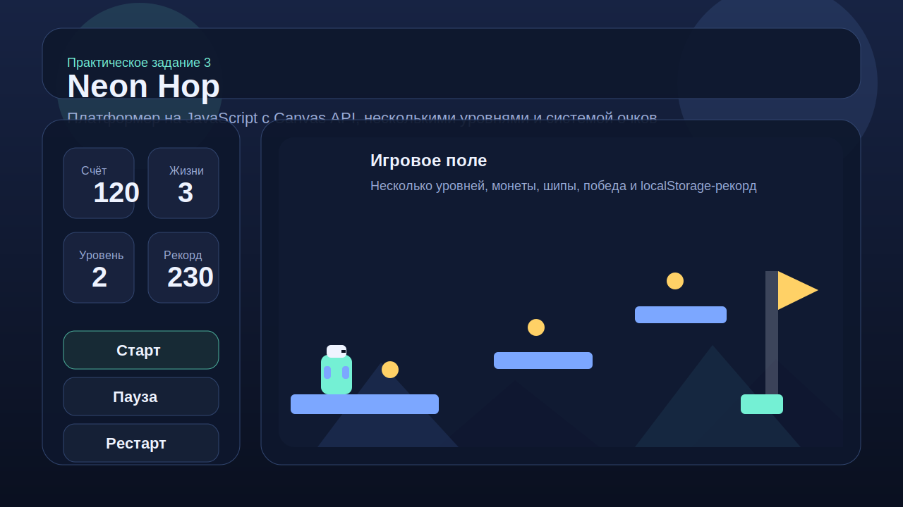

# Soft Hop — игра-платформер на JavaScript

Учебный проект для **Практического задания 3**. Это браузерная 2D-игра в жанре платформер, написанная на **Vanilla JavaScript** с использованием **HTML5 Canvas API**.

## Что реализовано

- управление персонажем: **A / D** или **стрелки ← / →**
- прыжок: **W / Space / ↑**
- плавное движение и игровая физика
- гравитация и коллизии с платформами
- опасные препятствия (шипы)
- сбор монет
- система очков
- 2 уровня
- условия победы и поражения
- пауза и рестарт
- сохранение лучшего результата через `localStorage`
- упрощённый фон для более плавной работы
- персонаж заменён на мяч

## Структура проекта

```text
index.html
css/
└── style.css
js/
├── main.js
├── Game.js
├── Player.js
├── Platform.js
├── Collision.js
├── Collectible.js
├── InputHandler.js
├── Renderer.js
└── levels.js
assets/
├── images/
│   └── preview.svg
└── sounds/
```

## Как запустить

### Локально

1. Скачай проект.
2. Открой папку в **VS Code / VSCodium**.
3. Запусти `index.html` через локальный сервер.
   Подойдёт, например, расширение **Live Server**.

### Через GitHub Pages

1. Создай новый репозиторий на GitHub.
2. Загрузи в него все файлы проекта.
3. В настройках репозитория открой раздел **Pages**.
4. В качестве источника выбери ветку `main` и корень `/root`.
5. После публикации игра будет доступна по ссылке GitHub Pages.

## Описание игровой логики

Игрок управляет мячом, проходит 2 уровня слева направо, собирает все монеты и только после этого активирует флаг. За монеты начисляются очки, за завершение уровня даётся дополнительный бонус. При столкновении с шипами или падении вниз игрок теряет жизнь. Если жизни заканчиваются — игра завершается. После прохождения второго уровня показывается экран победы.

## Использование нейросети

Согласно условию задания, в проекте использована нейросеть.

- **Использованная нейросеть:** ChatGPT
- **Примерное время выполнения:** 20–35 минут
- **Что было создано с помощью нейросети:**
  - структура проекта;
  - классы игры и игровая логика;
  - система коллизий;
  - интерфейс HUD;
  - README и общая архитектура.

## Что можно улучшить дальше

- добавить спрайты и покадровую анимацию персонажа;
- подключить звуковые эффекты и музыку;
- сделать экран выбора уровней;
- добавить врагов и бонусы;
- сделать мобильные кнопки управления.

## Скриншот проекта

Ниже лежит иллюстративный превью-файл проекта:


